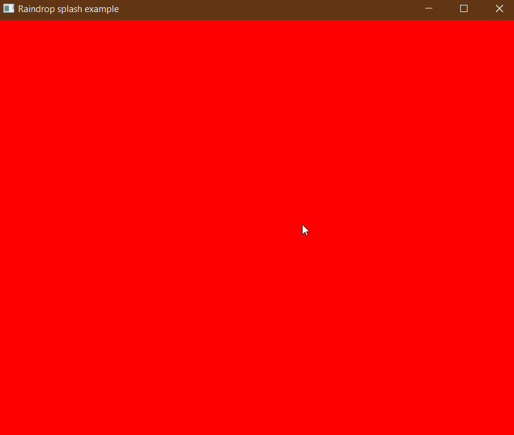

# anim
<!-- [](https://github.com/joylei/anim-rs/actions?query=workflow%3A%22Test+and+Build%22)
[](https://docs.rs/anim)
[](https://crates.io/crates/anim)
[](https://github.com/joylei/anim-rs/blob/master/LICENSE) -->

This is an animation library, works nicely with [Iced](https://github.com/hecrj/iced)  and the others.

## Showcase

<center>




</center>

## How to install?

Include `anim` in your `Cargo.toml` dependencies:

```toml
[dependencies]
anim = "0.1"
```

Note: `anim` turns on `iced-backend` feature by default. You need to disable default features if you do not work with `iced`.

```toml
[dependencies]
anim = { version="0.1", default-features = false }
```

## How to use?

There are 3 important concepts in `anim`:
- `Animatable`
Types derived from `Animatable` means that its values can be calculated based on timing progress, with which you can create `Animation` objects.

- `Animation`
The `Animation` generates values based on its timing progress. You can construct a big `Animation`  from small ones.

- `Timeline`
With `Timeline` you can control your animations' lifetime.

---

For simple scenarios, you just need `Options`.

```rust
use anim::{Options, Timeline, Animation, easing};
```

Then, build and start your animation:

```rust
let mut timeline = Options::new(20,100).easing(easing::bounce_ease())
    .duration(Duration::from_secs(1))
    .begin_animation();

loop {
    let status = timeline.update();
    if status.is_completed() {
       break; 
    }
    println!("animated value: {}", timeline.value());
}
```

For complex scenarios, please look at [examples](./examples/) to gain some ideas.


## How to run the examples?

### Example #1: `color-example`

This example shows you color animations:

```sh
cargo run --release --example color-example
```

### Example #2: `size-example`

This example shows you size animations:

```sh
cargo run --release --example size-example
```

### Example #3: `animated-splash`

This example shows you rain dop splash animations:

```sh
cargo run --release --example animated-splash
```

## License

MIT