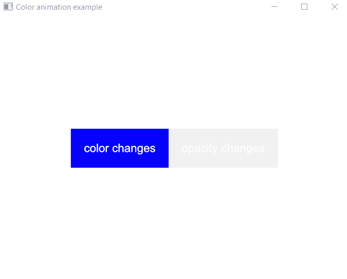
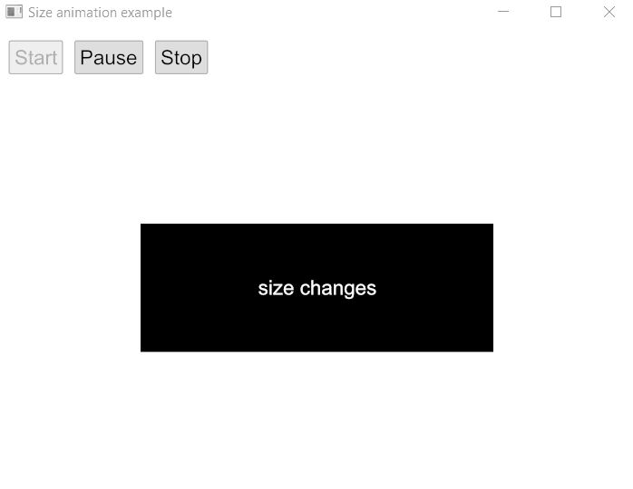

[EN](./README.md) | [中文](./README_zh.md)

# anim
[](https://github.com/joylei/anim-rs/actions?query=workflow%3A%22Test+and+Build%22)
[](https://docs.rs/anim)
[](https://crates.io/crates/anim)
[](https://github.com/joylei/anim-rs/blob/master/LICENSE)

纯Rust语言编写的动画库，可以配合[Iced](https://github.com/hecrj/iced)和其它GUI框架工作。

## 演示

<center>






</center>

## 怎么安装

添加 `anim` 到 cargo 项目中：

```toml
[dependencies]
anim = "0.1"
```

注意： `anim` 默认打开了 `iced-backend` 特性支持。你可以关掉这个特性：

```toml
[dependencies]
anim = { version="0.1", default-features = false }
```

## 怎么使用

`anim` 有三个重要的概念：
- `Animatable`
任何类型实现了 `Animatable`，那么意味着可以根据时间进度计算它的值。通过它可以创建`Animation`对象。

- `Animation`
`Animation` 根据时间进度产生新的值。可以通过组合 `Animation` 构建更大的`Animation` 对象。

- `Timeline`
通过`Timeline`控制动画的生命周期。

---

简单场景，只需要使用 `Options`。

```rust
use anim::{Options, Timeline, Animation, easing};
```

然后创建和运行动画：

```rust
use std::time::Duration;
use anim::{Options, Timeline, Animation, easing};

let mut timeline = Options::new(20,100).easing(easing::bounce_ease())
    .duration(Duration::from_millis(300))
    .begin_animation();

loop {
    let status = timeline.update();
    if status.is_completed() {
       break;
    }
    println!("animated value: {}", timeline.value());
}
```

更复杂的场景可以参考[示例代码](./examples/)。


## 示例

### 示例 #1: `color-example`

这个示例演示颜色的动画：

```sh
cargo run --release --example color-example
```

### 示例 #2: `size-example`

这个示例演示尺寸的动画：

```sh
cargo run --release --example size-example
```

### 示例 #3: `animated-splash`

这个示例演示雨水溅落的动画：

```sh
cargo run --release --example animated-splash
```

## 开源协议

MIT
